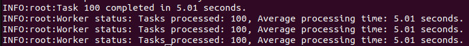
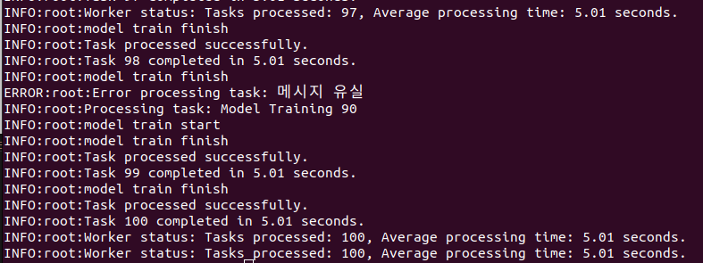
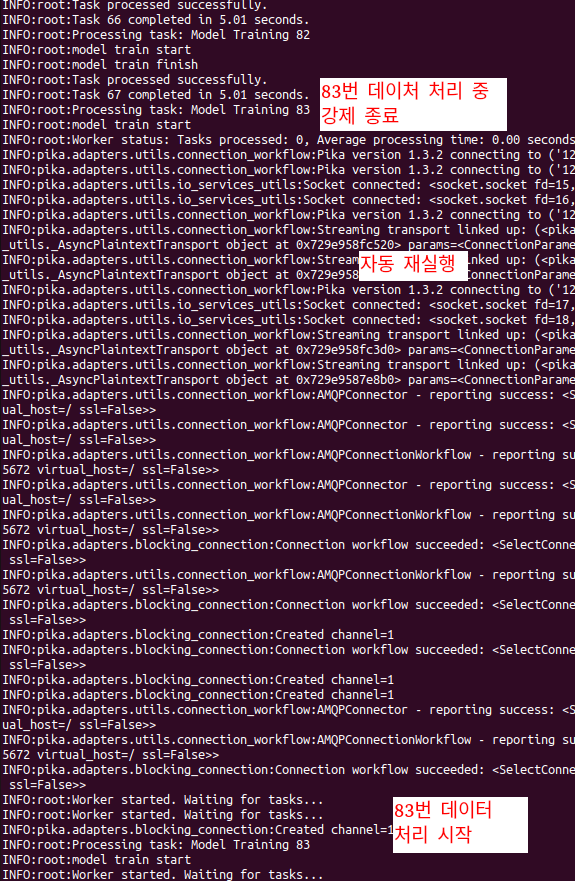

# 과제 개요

Multi-GPU resource를 효율적으로 사용하기 위한 안정적인 큐 시스템 구현하기

# 로직 상세 설명

## i. 작업 확인 및 재처리 매커니즘 구현

### 1. 작업 처리 후 큐에 **ACK(확인 메시지)** 전달

```python
# 작업 성공 시 ACK 전송
# ACK 를 전송하면 메시지 큐에서 해당 작업 제거
ch.basic_ack(delivery_tag=method.delivery_tag)
logging.info("Task processed successfully.")
```

### 2. 장애가 발생 시, 해당 작업을 다시 큐에 추가

```python
except Exception as e:
    logging.error(f"Error processing task: {e}")
    # 실패 시 NACK을 보내고 requeue=True 옵션을 통해 다시 큐에 넣음
    ch.basic_nack(delivery_tag=method.delivery_tag, requeue=True)
```

### 3. 작업의 중복 처리를 방지하기 위한 로직

```python
# durable 옵션을 True 로 사용하여 서버가 재시작되어도 큐와 메시지가 유지되도록 설정
# (메시지를 영구적으로 저장)
# 이 상태에서 ACK 가 전달되지 않으면 해당 작업을 다른 워커에 할당하지 않으므로
# 작업의 중복 처리가 방지됨
channel.queue_declare(queue='aiv_train_queue', durable=True)
```

### 4. 작업 처리에 관한 전체 함수

```python
def process_task(ch, method, properties, body):
    """
    큐에서 전달된 작업을 처리하는 함수입니다. 작업을 성공적으로 처리하면
    RabbitMQ에 ACK를 보내고, 실패하면 NACK을 보내서 작업을 다시 큐에 넣습니다.

    Args:
        ch: RabbitMQ 채널 객체
        method: 메시지 전달 관련 메타데이터 (delivery_tag 포함)
        properties: 메시지 속성 정보
        body: 큐에서 전달된 메시지 내용 (작업 데이터)
    """

    try:
        logging.info(f"Processing task: {body.decode()}")
        
        # 더미 학습
        dummy_train()

        # 작업 성공 시 ACK 전송
        ch.basic_ack(delivery_tag=method.delivery_tag)
        logging.info("Task processed successfully.")

    except Exception as e:
        logging.error(f"Error processing task: {e}")
        # 실패 시 NACK을 보내고 requeue=True 옵션을 통해 다시 큐에 넣음
        ch.basic_nack(delivery_tag=method.delivery_tag, requeue=True)

```

## ii. 워커 노드의 내결함성 강화

### 1. Threading 에서의 예외 처리 강화
- 예외 처리를 통해 에러가 발생해도 종료되지 않게 처리했습니다.
```python
def worker_thread():
    """
    RabbitMQ에서 작업을 가져와 처리하는 워커 스레드를 실행하는 함수입니다.
    큐에서 작업을 하나씩 가져와 처리하고, 처리 완료 후 ACK를 전송합니다.
    예외 발생 시 이를 잡아 스레드가 비정상적으로 종료되지 않도록 보호합니다.
    """

    try:
        connection, channel = create_channel()
        # durable 옵션을 True 로 사용하여 서버가 재시작되어도 큐와 메시지가 유지되도록 설정
        channel.queue_declare(queue='aiv_train_queue', durable=True)

        # 한 번에 하나의 작업만 처리할 수 있도록 설정
        channel.basic_qos(prefetch_count=1)

        # 작업을 처리할 콜백 함수 설정
        channel.basic_consume(queue='aiv_train_queue', on_message_callback=process_task)

        logging.info("Worker started. Waiting for tasks...")
        channel.start_consuming()

    # 예외 발생 시 스레드가 종료되지 않도록 보호
    except Exception as e:
        logging.error(f"Unexpected error in worker thread: {e}")
```

### 2. 워커 노드 프로세스가 장애로 종료되더라도 자동으로 재시작되도록 구성

- 프로세스 관리 도구인 supervisord 를 사용하여 프로세스가 종료되더라도 재시작 하도록 설정했습니다.

```
[program:worker]
command=python /home/inpyo/workspace/aiv/answer2/worker.py  # 절대 경로
autostart=true            # 자동 시작
autorestart=true          # 종료 시 자동 재시작
stderr_logfile=/var/log/worker.err.log  # log
stdout_logfile=/var/log/worker.out.log  # log

```
    
### 3. 워커 노드의 상태를 모니터링할 수 있는 로그 기능

- status 를 interval 마다 기록하는 다른 thread worker 생성
- 작업 처리 횟수와 총 처리 시간을 측정합니다.

```python
# 작업 처리 횟수 및 총 처리 시간 측정을 위한 변수
task_count = 0
total_processing_time = 0
worker_status_interval = 10  # 워커 상태를 기록할 시간 간격 (초)

def worker_status():
    """
    워커의 상태(가용성, 처리량)를 주기적으로 로그로 기록하는 함수입니다.
    """
    
    global task_count, total_processing_time
    while True:
        avg_processing_time = total_processing_time / task_count if task_count > 0 else 0
        logging.info(f"Worker status: Tasks processed: {task_count}, Average processing time: {avg_processing_time:.2f} seconds.")
        time.sleep(worker_status_interval)  # 지정한 시간 간격으로 상태 기록
```

## iii. 큐 시스템의 안정성 개선
### 1. 큐 시스템의 내장 기능을 활용하여 작업의 유실을 방지하고 지연된 작업을 처리

- RabbitMQ 의 내장 기능 Dead Letter Exchange, TTL 사용
- 메시지가 처리되지 않거나 일정 시간(TTL) 동안 큐에서 머물면 dlx_exchange 로 이동하도록 설정 추가
- TTL 은 3분으로 설정

```python
# Dead Letter Exchange와 TTL을 설정한 큐 선언
args = {
        'x-dead-letter-exchange': 'dlx_exchange',  # 메시지가 실패하면 dlx_exchange로 전달
        'x-message-ttl': 180000  # 메시지의 TTL을 3분(180000ms)로 설정
    }

channel.queue_declare(queue='aiv_train_queue', durable=True, arguments=args)

# Dead Letter 큐 선언
channel.queue_declare(queue='dlx_queue', durable=True)
channel.exchange_declare(exchange='dlx_exchange', exchange_type='direct')
channel.queue_bind(exchange='dlx_exchange', queue='dlx_queue')
```

### 2. 예를 들면 큐 클러스터링이나 미러링 큐를 이용하여 큐 시스템의 고가용성을 확보하는 방법을 제안하고 구현하세요 (구현이 어렵다면 설정 방법과 예상 효과를 설명하세요)

#### 미러링 큐 설정 방법

- RabbitMQ UI 에서 설정하거나 rabbitmqctl 을 통해 설정 가능합니다.
- 아래는 rabbitmqctl 로 설정하는 방법입니다.

```bash
sudo apt install rabbitmq-server
sudo rabbitmqctl set_policy ha-all "^aiv_train_queue$" '{"ha-mode":"all"}' --priority 0
```

#### 예상 효과
- 큐가 여러 RabbitMQ 노드에 복제되므로, 하나의 노드가 다운되더라도 다른 노드에서 계속해서 메시지를 처리할 수 있습니다.
- 메시지 처리 부하를 여러 노드에 분산하여 처리할 수 있어 성능이 향상됩니다.
- 메시지 유실 위험이 줄어들고, 높은 가용성을 유지할 수 있습니다.


# RabbitMQ의 특징 및 장단점

### 특징
RabbitMQ는 메시지 브로커로서 메시지 기반 통신을 구현하는 시스템입니다. </br>
메시지를 신뢰성 있게 전달하기 위한 프로토콜인 AMQP(Advanced Message Queuing Protocol) 을 기본으로 지원하여 메시지 전달 순서 보장, 메시지 중복 방지 등의 기능을 제공합니다. </br>
또한 다양한 플러그인을 통해 기능을 확장할 수 있는 확장성을 제공합니다.

### 장점
- RabbitMQ는 AMQP 외에도 MQTT, STOMP, HTTP 등 다양한 프로토콜을 지원하여 유연하게 통신
- Durable Queue, Persistent Message, ACK/NACK 등을 통해 메시지 유실을 방지하고, 정확한 전달을 보장
- 웹 기반의 관리 UI를 제공하여 큐와 메시지 상태를 쉽게 모니터링하고 관리
- 라우팅 옵션, 메시지 필터링, 스케줄링, Dead Letter Queue 등의 고급 기능을 제공

### 단점
- 기본적으로 디스크 기반 메시지 저장을 사용하여, 다른 메시지 브로커에 비해 처리량이 낮음
- 다양한 기능을 제공하는 만큼 설정이 복잡함

# Dependency

#### RabbitMQ
- 메시지 브로커
```bash
docker run -d --name rabbitmq -p 5672:5672 -p 15672:15672 rabbitmq:management
```
#### supervisor
- 데몬 및 백그라운드 프로세스를 관리하기 위한 도구
```bash
sudo apt-get install supervisor
```
#### pika
- Python에서 RabbitMQ와 통신하기 위한 라이브러리
```bash
pip install pika
```

# 빌드 및 실행 방법

## RabbitMQ 실행

```bash
docker run -d --name rabbitmq -p 5672:5672 -p 15672:15672 rabbitmq:management
```

```bash
# RabbitMQ 웹 접속
http://localhost:15672/
```

``` bash
# guest (admin) 계정으로 로그인
Username: guest
Password: guest
```

## supervisor 설치 및 Worker 실행

#### supervisor 설치
```bash
sudo apt-get update
sudo apt-get install supervisor
```

#### worker.conf 파일에서 python과 worker 파일 절대 경로 지정
```bash
[program:worker]
command=/~~~/~~~/~~~/python /~~~/~~~/~~~/worker.py
...
```

#### supervisord config 위치
```bash
sudo cp worker.conf /etc/supervisor/conf.d/worker.conf 
```

#### Worker 서비스 시작
```bash
sudo service supervisor restart
```

#### Worker 상태 확인
```bash
sudo supervisorctl status
```

## 테스트
```bash
python3 send.py
```

# 테스트 시나리오 및 평가

테스트 시나리오

1. 부하 테스트 시나리오
2. 메시지 유실 및 재처리 시나리오
3. 시스템 장애 시나리오

시스템의 내결함성 평가는 아래의 코드를 통해, 각각의 시나리오에 대해 100개의 메세지를 날려 테스트를 진행했습니다.

```python
def send_bulk_messages(message_count=100):
    """
    다수의 메시지를 큐에 전송하여 부하 테스트를 수행하는 함수입니다.
    """

    connection = pika.BlockingConnection(pika.ConnectionParameters('localhost'))
    channel = connection.channel()

    # 큐 선언
    channel.queue_declare(queue='aiv_train_queue', durable=True, arguments=args)

    for i in range(message_count):
        message = f"Model Training {i}"
        channel.basic_publish(exchange='',
                              routing_key='aiv_train_queue',
                              body=message)
        print(f"Sent {message}")
        time.sleep(0.1) 
    connection.close()

if __name__ == "__main__":
    send_bulk_messages(100)
```

### 1. 부하테스트 시나리오
- 100개의 데이터를 정상적으로 처리하는 지 여부

</br>

**100개 데이터 정상 처리 확인**

### 2. 메시지 유실 및 재처리 시나리오
- 20% 의 확률로 처리 중 오류를 발생시켜 시나리오 가정

```python
# 더미 학습
dummy_train()

if random.random() < 0.2:
    raise Exception("메시지 유실 및 재처리 데이터 발생")

# 작업 성공 시 ACK 전송
ch.basic_ack(delivery_tag=method.delivery_tag)
logging.info("Task processed successfully.")
```

</br>

**중간에 데이터 유실이 발생해도 100개 데이터 정상 처리 확인**

### 3. 시스템 장애 시나리오
- dummy_train 에서 5% 확률로 시스템이 종료 되는 시나리오 가정

```python
def dummy_train():
    """
    모델 학습을 시뮬레이션하는 함수입니다. 실제 모델 학습 대신 
    로그 메시지를 출력하고 5초간 대기합니다.
    """

    logging.info("model train start")
    
    if random.random() < 0.05:
        os._exit(1)
        
    time.sleep(3)
    logging.info("model train finish")

```
</br>

**시스템이 종료 돼도 supervisord를 통해 정상적으로 재실행 확인**

**83번 데이터 처리 중 강제 종료 -> 자동 실행 후 83번 데이터 처리 시작**

# Reference

https://www.rabbitmq.com/docs

https://pika.readthedocs.io/en/stable/

https://github.com/pika/pika

http://supervisord.org/

https://velog.io/@es_seong/RabbitMQ-with-Python

https://kimjingo.tistory.com/127

https://www.digitalocean.com/community/tutorials/how-to-install-and-manage-supervisor-on-ubuntu-and-debian-vps

https://yenoss.github.io/2017/09/10/supervisor.html

https://blog.microideation.com/2019/02/13/rabbitmq-configuration-for-ha-queue-mirroring/#:~:text=Queue%20mirroring%20is%20applied%20to%20the%20queues%20based%20on%20a

https://nilay-tiw.medium.com/how-to-configure-mirroring-ha-in-rabbit-mq-40dbc7bb1a41

https://www.svix.com/resources/guides/rabbitmq-cluster-setup-guide/

https://www.rabbitmq.com/docs/ttl