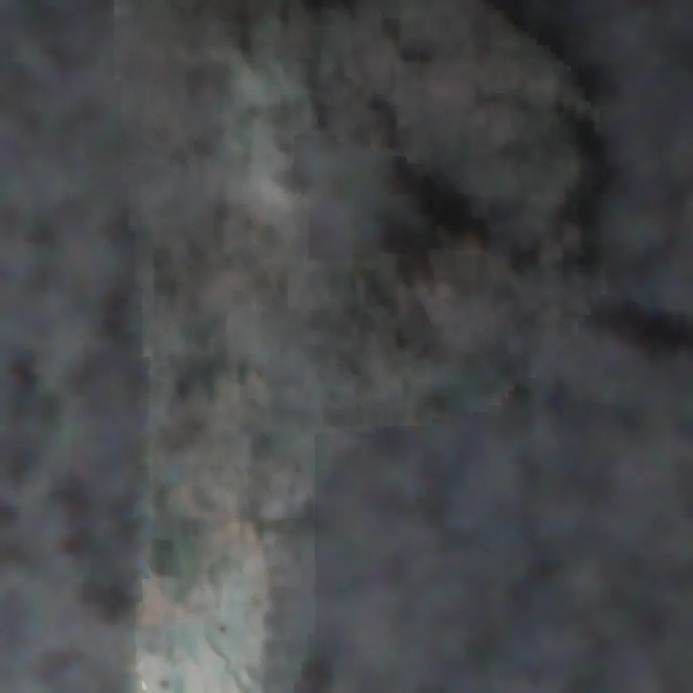

# 소개

AiV 의 OCR 모델을 만들기 위한 과제입니다.

제공받은 데이터 소스를 통해 실제 산업현장에서 사용할 수 있는 형태의 데이터 형태로 가공하여 학습을 진행했습니다.

모델은 Transformer Encoder - Decoder 구조를 통해 이미지 Input - OCR Output Task 를 해결하는 모델을 학습하였습니다. </br>

AutoRegressive Decoder 를 사용하기 때문에 원하는 구조대로 GT 를 구성하여, 최종 결과를 얻어낼 수 있습니다.

단순히 OCR 을 넘어 프롬프트를 통해 다른 태스크로 확장시킬 수 있는 구조를 선정했습니다.


# 방법론 선정 이유

1. 하나의 모델로 구축 및 후처리 최소화  </br>

    - 해당 문제를 해결하기 위해 하나의 아키텍쳐를 사용하고 후처리를 최소화 할 수 있는 방식 사용 
    - 하나의 아키텍처만 사용하기 때문에 관리가 용이합니다.


2. 기존 방식과 다른 방식 제안 </br>

    - 기존 AiV 홈페이지에 소개된 OCR 방식인 문자(character) 단위 인식 모델에서 단어(word) 단위 인식 모델로 제안 </br>
    *(실제 AiV 에서 OCR 을 처리하는 내부 로직을 알 수 없어 홈페이지 정보로 가정했습니다.)*
    - 각 방법의 장단점이 있지만 새로운 방식으로 제안해 봤습니다. </br>


3. 다양한 태스크로 확장 가능한 구조 </br>

    - 단순히 하나의 이미지에서 하나의 정보만 추출하는 것을 넘어서, 여러 정보를 추출하게 되는 경우를 위한 확장성 고려
    - 프롬프트를 활용하여 OCR 의 결과를 커스텀 하거나, 태스크를 추가할 수 있습니다.


# Model

## 1. 모델 개요

Reference - [Donut : OCR-free Document Understanding Transformer](https://arxiv.org/pdf/2111.15664)

Donut Offical Architecture Code 에서 핵심 아키텍처 코드는 활용하였으며, 과제 Task 를 위한 추가적인 코드를 구현하였습니다.


</br>


## 2. Model Architecture

모델은 이미지 Feature 를 뽑기 위한 SwinTransformer Encoder를 사용하며, OCR의 결과를 얻기 위한 Bart Decoder 를 사용됩니다.

</br>

### [ Encoder ]
- 이미지 인코더는 SwinTransformer 입니다.

- SwinTransformer 는 계층 구조를 통해 로컬 feature 부터 글로벌 feature 까지 다양하게 학습할 수 있습니다.
- 또한 Transformer의 특징으로 강력한 Image Backbone 으로 사용 가능합니다.
- 연산량이 많다는 단점이 존재하지만 실제 OnDevice나 Embedded 환경에서의 최적화가 필요하다면, 이미지 Encoder 를 CNN base model 로 변경하거나, Patch Embedding 을 사용하는 방식으로 개선가능합니다.</br>


### [ Decoder ]
- 텍스트 디코더는 BartDecoder 입니다.</br>
- Transformer 의 Query 로 프롬프트를 입력하며, 이 프롬프트 쿼리를 통해 다양한 태스크로 확장시킬 수 있습니다. </br>
- 이 쿼리는 이미지 Encoder 에서 추출한 최종 Hidden state 와 cross-attention 을 통해 원하는 OCR 결과를 AutoRegressive 하게 생성합니다.</br>

- 예1) 하나의 모델을 통해 Bolt 에 기입된 OCR, Nut 에 기입된 OCR 분리 </br>
- 예2) 하나의 모델을 통해 전체 OCR 또는, 특정 조건에 해당하는 OCR 정보만 추출 가능 </br>


## 3. Model Method

</br>

### [ Training ]
- Task Parsing 토큰 Decoder 에 제공 (이번 경우에는 Aiv데이터 & OCRTask)
- Teacher Forcing 방식으로 토큰 예측
- Cross Entropy Loss 사용

### [ Inference ]
- Task Parsing 토큰 Decoder 에 제공 (Aiv데이터 & OCRTask)
- AutoRegressive 하게 토큰 예측
- 최종 예측 결과 Json Format 으로 파싱


## 4. 사전 학습 모델
[huggingface : naver-clova-ix/donut-base](https://huggingface.co/naver-clova-ix/donut-base)

- 사전 학습 모델은 위 모델을 사용했습니다. </br>
- 사전 학습 시 pseudo-OCR 을 학습하는 방식을 사용했습니다. </br>
- 위 사전학습 모델은 사전학습하기 위해 IIT-CDIP와 SynthDoG 생성 데이터를 사용했습니다. </br>

</br>


# Dataset


## 1. 배경 소스 준비

소스 이미지를 활용하여 실제 산업 환경에서 사용할만한 비슷한 배경을 만들어 데이터 셋을 구축했습니다.

### 소스 이미지

</br>


### [ Method 1 ] - 회색 톤의 랜덤 배경 생성 (Code)
``` python
def create_random_background_image(width, height):
    base_color = (63, 65, 68)

    def vary_color(color, variation=10):
        return tuple(min(max(c + random.randint(-variation, variation), 0), 255) for c in color)
    
    background_color = vary_color(base_color)
    
    background = Image.new("RGB", (width, height), background_color)
    
    return background
```

 </br>

장점 : 단순히 코드 작업만으로 배경을 생성 가능

단점 : 디테일을 살리기 위해 실제 데이터에 Fit 한 코드 작업이 필요 </br>

### [ Method 2 ] - Diffusion 을 사용한 Inpaint
사용 모델 : [RealVisXL V5.0 Lightning](https://huggingface.co/SG161222/RealVisXL_V5.0_Lightning) </br>
 </br>

장점 : Diffusion 모델을 사용하여 배경 Feature가 최대한 회손되지 않은 채 유지

단점 : Fitting 된 모델이 없어 글자 영역의 제거가 완벽하게 이뤄지지 않음

### [ Method 3 ] - 포토샵 도구 (GIMP) 사용

 </br>

장점 : 원하는 결과를 디테일하게 얻어낼 수 있음

단점 : 데이터의 pixel feature 정보가 망가질 수 있음

-> 과제라는 한정된 시간에 가장 유효한 방법인 [ Method 3 ] 방식을 통해 생성했습니다.

## 2. 데이터 생성

**generate_image.py**  파일을 통해 학습 Image, GT 생성 </br>
</br>
Train / Validation / Test : 1000 / 200 / 100 장 데이터 생성

### [ 최종 생성 데이터 ]

### Image
 </br>

### GT

```json
"gt_parse": {
                "ocr": "5VYIV",
                "box": [44, 220, 100, 140]  # x, y, w, h
            }
```

## 3. Augmentation

### 구현한 augmentation

```
RandomHorizontalFlip # 랜덤 좌우 반전

RandomRotation # 랜덤 회전

brightness # 밝기

contrast # 대비

saturation # 채도 

hue # 색조

GaussianBlur # 가우시안 블러

random_erasing # 무작위 지우기

random_crop # 랜덤 크롭

```

- DataLoader 에서 Augmetation 을 적용하였습니다.

- 실제 데이터의 특성을 고려해 랜덤 회전 및 밝기, 대비, 채도, 가우시안 블러를 사용했습니다. 

- 글자에 영향을 줄 수 있는 좌우 반전, 크롭, 지우기는 성능 이슈로 활성화하지 않았습니다.

### Augmentation 결과 (vis input)

 </br>

# Result

##  Inference 구조

```
Predict: <s_ocr>P5I</s_ocr><s_box>64<sep/>170<sep/>300<sep/>140<s_box>                                                                        
Answer: <s_ocr>P5I</s_ocr><s_box>60<sep/>178<sep/>300<sep/>140</s_box>
```

## Visualization
<p align="center">
  
  
</p>
<p align="center">
  
  
</p>

## Evaluation

| Text   | BOX    | BOX   |
|--------|--------|--------|
|Accuracy|Precison|Recall  |
| 0.95   | 0.93   | 0.93   |

## GT -> PRED 분석
Test 결과 40개를 가져왔습니다.
```
0 : YPU -> YPU
1 : 1 -> 1
* 2 : I1 -> I4
3 : TVVVT -> TVVVT
4 : VP -> VP
5 : 11I -> 11I
6 : IPV -> IPV
7 : I -> I
8 : UPV -> UPV
9 : TUI -> TUI
10 : T1P -> T1P
11 : PTV -> PTV
12 : 5IITT -> 5IITT
13 : I5P -> I5P
14 : 5PVU -> 5PVU
15 : ITYU -> ITYU
16 : PV -> PV
17 : I5Y -> I5Y
18 : YY -> YY
19 : 1U -> 1U
20 : 5T5T -> 5T5T
21 : U1T -> U1T
22 : T5T -> T5T
23 : PP -> PP
24 : 55TI -> 55TI
25 : VPYY -> VPYY
* 26 : VP1 -> VP4
27 : VI1Y1 -> VI1Y1
28 : UI51Y -> UI51Y
29 : YVT -> YVT
30 : 1PY5V -> 1PY5V
31 : P -> P
32 : 5 -> 5
33 : UT5IY -> UT5IY
34 : I5 -> I5
35 : TVI -> TVI
36 : TTT1I -> TTT1I
37 : 5 -> 5
38 : UTYU -> UTYU
39 : PY -> PY
40 : 1UUP -> 1UUP
```

## 오류 케이스
```
* 2 : I1 -> I4
* 26 : VP1 -> VP4
```
위와 같이 마지막에 1이 들어간 데이터를 4로 잘못 예측한 케이스가 발견됐습니다.

사전학습 모델에서 비슷한 형태로 학습된 4로 인해 Hallucination 이 발생했다고 판단됩니다.

#### 해결 방안 1.
- 학습 데이터에 마지막에 1이 들어가는 데이터를 추가 생성 학습
#### 해결 방안 2.
- 타켓 문자에 4가 없기 때문에 타겟 문자 (15IPTUVY) 만 검출 될 수 있도록 softmax, argmax 단계에서 타겟 외 token masking 적용
#### 해결 방안 3.
- (가능하다면) 1과 4가 헷갈리지 않도록 4 데이터도 포함 학습

# Limitation

- 사용한 사전 학습 모델이 pseudo-OCR 을 학습하였으며, 모든 토큰에 대해 CrossEntropyLoss 를 사용합니다.
- Localization 을 위한 토큰을 따로 생성하여, Regression Loss 를 계산하면 더 높은 Localization score를 얻을 것으로 예상되나 사전 학습을 추가로 진행해야 합니다.
- 과제가 아닌 실제 프로젝트라면 해당 제한사항을 고려하여 개선하겠습니다. 


